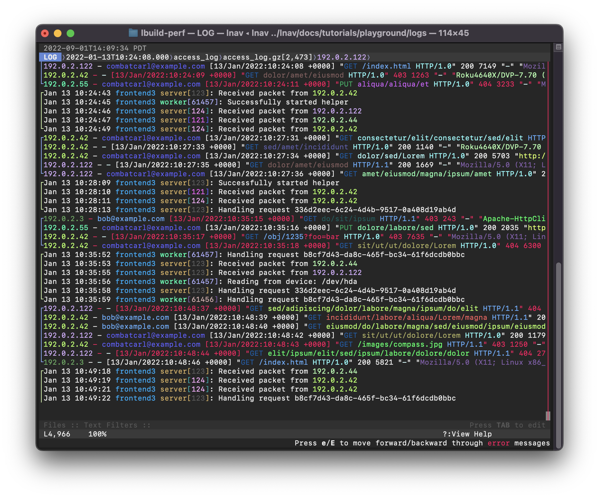

<!-- This is a comment for testing purposes -->

[](https://github.com/tstack/lnav/actions?query=workflow%3Aci-build)
[](https://docs.lnav.org)
[](https://coveralls.io/github/tstack/lnav?branch=master)
[](https://snapcraft.io/lnav)
[](https://gurubase.io/g/lnav)

[](https://discord.gg/erBPnKwz7R)

_This is the source repository for **lnav**, visit [https://lnav.org](https://lnav.org) for a high level overview._

# LNAV -- The Logfile Navigator

The Logfile Navigator is a log file viewer for the terminal.  Given a
set of files/directories, **lnav** will:

- decompress as needed;
- detect their format;
- merge the files together by time into a single view;
- tail the files, follow renames, find new files in directories;
- build an index of errors and warnings;
- [pretty-print JSON-lines](https://docs.lnav.org/en/latest/formats.html#json-lines).

Then, in the **lnav** TUI, you can:

- jump quickly to the previous/next error ([press `e`/`E`](https://docs.lnav.org/en/latest/hotkeys.html#spatial-navigation));
- search using regular expressions ([press `/`](https://docs.lnav.org/en/latest/hotkeys.html#spatial-navigation));
- highlight text with a regular expression ([`:highlight`](https://docs.lnav.org/en/latest/commands.html#highlight-pattern) command);
- filter messages using [regular expressions](https://docs.lnav.org/en/latest/usage.html#regular-expression-match) or [SQLite expressions](https://docs.lnav.org/en/latest/usage.html#sqlite-expression);
- pretty-print structured text ([press `P`](https://docs.lnav.org/en/latest/ui.html#pretty));
- view a histogram of messages over time ([press `i`](https://docs.lnav.org/en/latest/ui.html#hist));
- query messages using SQLite ([press `;`](https://docs.lnav.org/en/latest/sqlext.html))

## Screenshot

The following screenshot shows a mix of syslog and web access log
files.  Failed requests are shown in red.  Identifiers, like IP
address and PIDs are semantically highlighted.

[](docs/assets/images/lnav-front-page.png)

## Why not **just** use `tail`/`grep`/`less`?

The standard Unix utilities are great for processing raw text lines,
however, they do not understand log messages.  Tail can watch
multiple files at a time, but it won't display messages in order by
time and you can't scroll backwards.  Grep will only find matching
lines, but won't return a full multi-line log message.  Less can only
display a single file at a time.  Also, none of these basic tools 
handle compressed files.

## Try online before installing

You can SSH into a demo node to play with lnav before installing.

The "playground" account starts lnav with a couple of log files as
an example:

[`$ ssh playground@demo.lnav.org`](ssh://playground@demo.lnav.org)

The "tutorial 1" account is an interactive tutorial that can teach 
you the basics of operation:

[`$ ssh tutorial1@demo.lnav.org`](ssh://tutorial1@demo.lnav.org)

## Installation

[Download a statically-linked binary for Linux/MacOS from the release page](https://github.com/tstack/lnav/releases/latest#release-artifacts)

### Brew on MacOS

```console
$ brew install lnav
```

## Usage

Simply point **lnav** at the files or directories you want to
monitor, it will figure out the rest:

```console
$ lnav /path/to/file1 /path/to/dir ...
```

The **lnav** TUI will pop up right away and begin indexing the 
files. Progress is displayed in the "Files" panel at the 
bottom. Once the indexing has finished, the LOG view will display 
the log messages that were recognized[^1]. You can then use the 
usual hotkeys to move around the view (arrow keys or
`j`/`k`/`h`/`l` to move down/up/left/right).

See the [Usage section](https://docs.lnav.org/en/latest/usage.html)
of the online documentation for more information.

[^1]: Files that do not contain log messages can be seen in the 
      TEXT view (reachable by pressing `t`).

### Usage with `systemd-journald`

On systems running `systemd-journald`, you can use `lnav` as the pager:

```
$ journalctl | lnav
```

or in follow mode:

```
$ journalctl -f | lnav
```

Since `journalctl`'s default output format omits the year, if you are
viewing logs which span multiple years you will need to change the
output format to include the year, otherwise `lnav` gets confused:

```
$ journalctl -o short-iso | lnav
```

It is also possible to use `journalctl`'s json output format and `lnav`
will make use of additional fields such as PRIORITY and \_SYSTEMD_UNIT:

```
$ journalctl -o json | lnav
```

In case some MESSAGE fields contain special characters such as
ANSI color codes which are considered as unprintable by journalctl,
specifying `journalctl`'s `-a` option might be preferable in order
to output those messages still in a non-binary representation:

```
$ journalctl -a -o json | lnav
```

If using systemd v236 or newer, the output fields can be limited to
the ones actually recognized by `lnav` for increased efficiency:

```
$ journalctl -o json --output-fields=MESSAGE,PRIORITY,_PID,SYSLOG_IDENTIFIER,_SYSTEMD_UNIT | lnav
```

If your system has been running for a long time, for increased
efficiency you may want to limit the number of log lines fed into
`lnav`, e.g. via `journalctl`'s `-n` or `--since=...` options.

In case of a persistent journal, you may want to limit the number
of log lines fed into `lnav` via `journalctl`'s `-b` option.

## Support

Please file issues on this repository or use the discussions section.
The following alternatives are also available:

- [support@lnav.org](mailto:support@lnav.org)
- [Discord](https://discord.gg/erBPnKwz7R)
- [Google Groups](https://groups.google.com/g/lnav)

## Links

- [Main Site](https://lnav.org)
- [**Documentation**](https://docs.lnav.org) on Read the Docs
- [Internal Architecture](ARCHITECTURE.md)

## Contributing

- [Become a Sponsor on GitHub](https://github.com/sponsors/tstack)

### Building From Source

#### Prerequisites

The following software packages are required to build lnav:

- gcc/clang  - A C++14-compatible compiler.
- libpcre2   - The Perl Compatible Regular Expression v2 (PCRE2) library.
- sqlite     - The SQLite database engine.  Version 3.9.0 or higher is required.
- ncurses    - The ncurses text UI library.
- readline   - The readline line editing library.
- zlib       - The zlib compression library.
- bz2        - The bzip2 compression library.
- libcurl    - The cURL library for downloading files from URLs.  Version 7.23.0 or higher is required.
- libarchive - The libarchive library for opening archive files, like zip/tgz.
- wireshark  - The 'tshark' program is used to interpret pcap files.
- cargo/rust - The Rust language is used to build the PRQL compiler.

#### Build

Lnav follows the usual GNU style for configuring and installing software:

Run `./autogen.sh` if compiling from a cloned repository.

```console
$ ./configure
$ make
$ sudo make install
```

## See Also

[Angle-grinder](https://github.com/rcoh/angle-grinder) is a tool to slice and dice log files on the command-line.
If you're familiar with the SumoLogic query language, you might find this tool more comfortable to work with.
