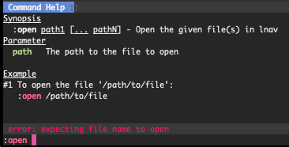
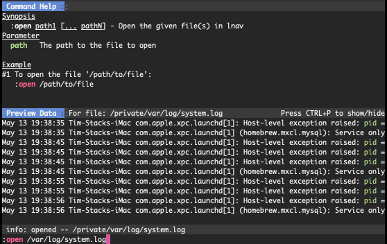
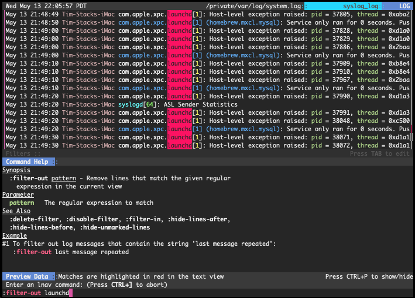
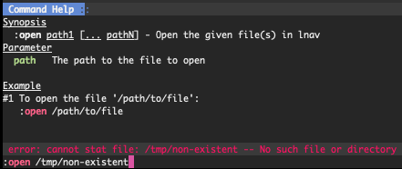

.. role:: lnavcmd(code)
   :language: lnav
   :class: highlight

.. _commands:

Commands
========

Commands provide access to some of the more advanced features in **lnav**, like
:ref:`filtering<filtering>` and
:ref:`"search tables"<search_tables>`.  You can activate the command
prompt by pressing the :kbd:`:` key.  At the prompt, you can start typing
in the desired command and/or double-tap :kbd:`TAB` to activate
auto-completion and show the available commands.  To guide you in the usage of
the commands, a help window will appear above the command prompt with an
explanation of the command and its parameters (if it has any).  For example,
the screenshot below shows the help for the :code:`:open` command:

   Screenshot of the online help for the :code:`:open` command.

In addition to online help, many commands provide a preview of the effects that
the command will have.  This preview will activate shortly after you have
finished typing, but before you have pressed :kbd:`Enter` to execute the
command.  For example, the :code:`:open` command will show a preview of the
first few lines of the file given as its argument:

   Screenshot of the preview shown for the :code:`:open` command.

The :lnavcmd:`:filter-out pattern` command is another instance where the preview behavior
can help you craft the correct command-line.  This command takes a PCRE2 regular
expression that specifies the log messages that should be filtered out of the
view.  The preview for this command will highlight the portion of the log
messages that match the expression in red.  Thus, you can be certain that the
regular expression is matching the log messages you are interested in before
committing the filter.  The following screenshot shows an example of this
preview behavior for the string "launchd":

   Screenshot showing the preview for the :code:`:filter-out` command.

Any errors detected during preview will be shown in the status bar right above
the command prompt.  For example, an attempt to open an unknown file will show
an error message in the status bar, like so:

   Screenshot of the error shown when trying to open a non-existent file.

.. tip::

  Note that almost all commands support TAB-completion for their arguments.
  So, if you are in doubt as to what to type for an argument, you can double-
  tap the :kbd:`TAB` key to get suggestions.  For example, the
  TAB-completion for the :code:`filter-in` command will suggest words that are
  currently displayed in the view.

.. note:: The following commands can be disabled by setting the ``LNAVSECURE``
   environment variable before executing the **lnav** binary:

   - :code:`:open`
   - :code:`:pipe-to`
   - :code:`:pipe-line-to`
   - :code:`:write-*-to`

   This makes it easier to run **lnav** in restricted environments without the
   risk of privilege escalation.

Reference
---------

.. include:: ../../src/internals/cmd-ref.rst
