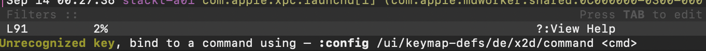

.. _Configuration:

Configuration
=============

The configuration for **lnav** is stored in JSON files that are read on
startup.  Files are consumed from multiple locations and update the
internal configuration state as they are processed.  File names must
end with :file:`.json` if they are in a :file:`configs` directory or,
if they are in a :file:`formats` directory [#]_, start with :file:`config.`
and end with :file:`.json`.  The following enumerates the order in
which files are processed (where :file:`<lnav-home>` refers to the
location in the :envvar:`HOME` directory where files are stored,
either: :file:`~/.lnav` or :file:`~/.config/lnav`):

#. Builtin -- The default configuration is shipped inside the **lnav** binary.

#. :file:`/etc/lnav/configs/*/*.json`,
   :file:`/etc/lnav/formats/*/config.*.json` -- System-wide configuration files
   can be installed in these locations to make it available to all users.

#. :file:`<lnav-home>/configs/default/*.json` -- The default configuration
   files that are built into lnav are written to this directory with :file:`.sample`
   appended. Removing the :file:`.sample` extension and editing the file will
   allow you to do basic customizations.

#. :file:`<lnav-home>/configs/*/*.json`,
   :file:`<lnav-home>/formats/*/config.*.json` -- Other directories under
   home will be scanned for JSON files. This structure is convenient for installing
   **lnav** configurations, like from a git repository.  The :file:`configs/installed`
   directory is reserved for files that are installed using the :option:`-i`
   flag (e.g. :code:`$ lnav -i /path/to/config.json`).

#. :file:`-I <path>/configs/*/*.json`,
   :file:`-I <path>/formats/*/*.json` -- Include directories passed on the
   command-line can have a :file:`configs` directory that will also be searched.

#. :file:`<lnav-home>/config.json` -- Contains local customizations that were
   done using the :code:`:config` command.

A valid **lnav** configuration file must contain an object with the
:code:`$schema` property, like so:

.. code-block:: json

   {
       "$schema": "https://lnav.org/schemas/config-v1.schema.json"
   }

.. note::

  Log format definitions are stored separately in the :file:`~/.lnav/formats`
  directly.  See the :ref:`Log Formats<log_formats>` chapter for more
  information.

.. note::

  Configuration files are read in the above directory order and sorted
  by path name.  The internal configuration is updated as files are
  parsed, so one file can overwrite the settings from another.  You can
  use the :ref:`Management CLI<management_cli>` to get the final
  configuration and where the value came from for a particular
  configuration option.

.. [#] Putting log format files and configuration files in the same directory
  can be convenient for organizations that wish to have a single git repository
  that contains all of the files needed for folks to do their work.

Options
-------

The following configuration options can be used to customize the **lnav** UI to
your liking.  The options can be changed using the :code:`:config` command.

.. jsonschema:: ../schemas/config-v1.schema.json#/properties/ui/properties/keymap

.. jsonschema:: ../schemas/config-v1.schema.json#/properties/ui/properties/theme

.. jsonschema:: ../schemas/config-v1.schema.json#/properties/ui/properties/clock-format

.. jsonschema:: ../schemas/config-v1.schema.json#/properties/ui/properties/dim-text

.. jsonschema:: ../schemas/config-v1.schema.json#/properties/ui/properties/default-colors

.. _themes:

Theme Definitions
-----------------

User Interface themes are defined in a JSON configuration file.  A theme is
made up of the style definitions for different types of text in the UI.  A
:ref:`definition<theme_style>` can include the foreground/background colors
and the bold/underline attributes.  The style definitions are broken up into
multiple categories for the sake of organization.  To make it easier to write
a definition, a theme can define variables that can be referenced as color
values.

Variables
^^^^^^^^^

The :code:`vars` object in a theme definition contains the mapping of variable
names to color values.  These variables can be referenced in style definitions
by prefixing them with a dollar-sign (e.g. :code:`$black`).  The following
variables can also be defined to control the values of the ANSI colors that
are log messages or plain text:

.. csv-table:: ANSI colors
   :header: "Variable Name", "ANSI Escape"

   "black", "ESC[30m"
   "red", "ESC[31m"
   "green", "ESC[32m"
   "yellow", "ESC[33m"
   "blue", "ESC[34m"
   "magenta", "ESC[35m"
   "cyan", "ESC[36m"
   "white", "ESC[37m"

Specifying Colors
^^^^^^^^^^^^^^^^^

Colors can be specified using hexadecimal notation by starting with a hash
(e.g. :code:`#aabbcc`) or using a color name as found at
http://jonasjacek.github.io/colors/.  If colors are not specified for a style,
the values from the :code:`styles/text` definition.

.. note::

  When specifying colors in hexadecimal notation, you do not need to have an
  exact match in the XTerm 256 color palette.  A best approximation will be
  picked based on the `CIEDE2000 <https://en.wikipedia.org/wiki/Color_difference#CIEDE2000>`_
  color difference algorithm.

Example
^^^^^^^

The following example sets the black/background color for text to a dark grey
using a variable and sets the foreground to an off-white.  This theme is
incomplete, but it works enough to give you an idea of how a theme is defined.
You can copy the code block, save it to a file in
:file:`~/.lnav/configs/installed/` and then activate it by executing
:code:`:config /ui/theme example` in lnav.  For a more complete theme
definition, see one of the definitions built into **lnav**, like
`monocai <https://github.com/tstack/lnav/blob/master/src/themes/monocai.json>`_.

.. code-block:: json

  {
      "$schema": "https://lnav.org/schemas/config-v1.schema.json",
      "ui": {
          "theme-defs": {
              "example1": {
                  "vars": {
                      "black": "#2d2a2e"
                  },
                  "styles": {
                      "text": {
                          "color": "#f6f6f6",
                          "background-color": "$black"
                      }
                  }
              }
          }
      }
  }

Reference
^^^^^^^^^

.. jsonschema:: ../schemas/config-v1.schema.json#/properties/ui/properties/theme-defs/patternProperties/^([\w\-]+)$/properties/vars

.. jsonschema:: ../schemas/config-v1.schema.json#/properties/ui/properties/theme-defs/patternProperties/^([\w\-]+)$/properties/styles

.. jsonschema:: ../schemas/config-v1.schema.json#/properties/ui/properties/theme-defs/patternProperties/^([\w\-]+)$/properties/syntax-styles

.. jsonschema:: ../schemas/config-v1.schema.json#/properties/ui/properties/theme-defs/patternProperties/^([\w\-]+)$/properties/status-styles

.. jsonschema:: ../schemas/config-v1.schema.json#/properties/ui/properties/theme-defs/patternProperties/^([\w\-]+)$/properties/log-level-styles

.. _theme_style:

.. jsonschema:: ../schemas/config-v1.schema.json#/definitions/style

.. _keymaps:

Keymap Definitions
------------------

Keymaps in **lnav** map a key sequence to a command to execute.  When a key is
pressed, it is converted into a hex-encoded string that is looked up in the
keymap.  The :code:`command` value associated with the entry in the keymap is
then executed.  Note that the "command" can be an **lnav**
:ref:`command<commands>`, a :ref:`SQL statement/query<sql-ext>`, or an
**lnav** script.  If an :code:`alt-msg` value is included in the entry, the
bottom-right section of the UI will be updated with the help text.

.. note::

  Not all functionality is available via commands or SQL at the moment.  Also,
  some hotkeys are not implemented via keymaps.

Key Sequence Encoding
^^^^^^^^^^^^^^^^^^^^^

Key presses are converted into a string that is used to lookup an
entry in the keymap.  Function keys are encoded as an :code:`f` followed by
the key number.  Other keys are encoded as UTF-8 bytes and formatted as an
:code:`x` followed by the hex-encoding in lowercase.  For example, the encoding
for the :code:`£` key would be :code:`xc2xa3`.  To make it easier to discover the
encoding for unassigned keys, **lnav** will print in the command prompt the
:code:`:config` command and
`JSON-Pointer <https://tools.ietf.org/html/rfc6901>`_ for assigning a command
to the key.

  Screenshot of the command prompt when an unassigned key is pressed.

.. note::

  Since **lnav** is a terminal application, it can only receive keypresses that
  can be represented as characters or escape sequences.  For example, it cannot
  handle the press of a modifier key.

Reference
^^^^^^^^^

.. jsonschema:: ../schemas/config-v1.schema.json#/properties/ui/properties/keymap-defs/patternProperties/^([\w\-]+)$

Log Handling
------------

The handling of logs is largely determined by the
:ref:`log file formats<log_formats>`, this section covers options that are not
specific to a particular format.

Timezone Conversion (v0.12.0+)
^^^^^^^^^^^^^^^^^^^^^^^^^^^^^^

Log messages that have a numeric timezone, like :code:`-03:00` or :code:`Z`
for UTC, will be converted to the local timezone as given by the :envvar:`TZ`
environment variable. For example, a timestamp ending in `-03:00` will be treated
as three hours behind UTC and then adjusted to the local timezone.

This behavior can be disabled by setting the
:code:`/log/date-time/convert-zoned-to-local` configuration property to
:code:`false`.

Watch Expressions (v0.11.0+)
^^^^^^^^^^^^^^^^^^^^^^^^^^^^

Watch expressions can be used to fire an event when a log message matches a
condition.  You can then install a listener for these events and trigger an
action to be performed.  For example, to automate filtering based on
identifiers, a watch expression can match messages that mention the ID and then
a trigger can install a filter for that ID.  Creating a watch expression is
done by adding an entry into the :code:`/log/watch-expressions` configuration
tree.  For example, to create a watch named "dhcpdiscover" that matches
DHCPDISCOVER messages from the :code:`dhclient` daemon, you would run the
following:

.. code-block:: lnav

   :config /log/watch-expressions/dhcpdiscover/expr :log_procname = 'dhclient' AND startswith(:log_body, 'DHCPDISCOVER')

The watch expression can refer to column names in the log message by prefixing
them with a colon.  The expression is evaluated by passing the log message
fields as bound parameters and not against a table.  The easiest way to test
out an expression is with the :ref:`mark_expr` command, since it will behave
similarly.  After changing the configuration, you'll need to restart lnav
for the effect to take place.  You can then query the :code:`lnav_events`
table to see any generated
:code:`https://lnav.org/event-log-msg-detected-v1.schema.json` events from the
logs that were loaded:

.. code-block:: custsqlite

   ;SELECT * FROM lnav_events

From there, you can create a SQLite trigger on the :code:`lnav_events` table
that will examine the event contents and perform an action.  See the
:ref:`Events` section for more information on handling events.

Annotations (v0.12.0+)
^^^^^^^^^^^^^^^^^^^^^^

Annotations are content generated by a script for a given log message and
displayed along with the message, like comments and tags.  Since the script
is run asynchronously, it can do complex analysis without delaying loading
or interrupting the viewing experience.  An annotation is defined by a
condition and a handler in the **lnav** configuration. The condition is
tested against a log message to determine if the annotation is applicable.
If it is, the handler script will be executed for that log message when
the user runs the :ref:`:annotate<annotate>` command.

Conditions are SQLite expressions like the ones passed to
:ref:`:filter-expr<filter_expr>` where the expression is appended to
:code:`SELECT 1 WHERE`.  The expression can use bound variables that
correspond to the columns that would be in the format table and are
prefixed by a colon (:code:`:`).  For example, the standard
:code:`log_opid` table column can be access by using :code:`:log_opid`.

.. note:: The expression is executed with bound variables because it
  can be applied to log messages from multiple formats.  Writing an
  expression that could handle different formats would be more
  challenging.  In this approach, variables for log message fields
  that are not part of a format will evaluate to :code:`NULL`.

Handlers are executable script files that should be co-located with
the configuration file that defined the annotation.  The handler will
be executed and a JSON object with log message data fed in on the
standard input.  The handler should then generate the annotation
content on the standard output.  The output is treated as Markdown,
so the content can be styled as desired.

Demultiplexing (v0.12.3+)
^^^^^^^^^^^^^^^^^^^^^^^^^

Files that are a mix of content from different sources, like
the output of :code:`docker compose logs`, can be automatically
demultiplexed so that *lnav* can process them correctly.  Each
line of the input file must have a unique identifier that can
be used to determine which service the line belongs to.  The
lines are then distributed to separate files based on the
identifier.  A demultiplexer is a regular expression that
extracts the identifier, the log message, and an optional
timestamp.

Demultiplexers are defined in the main configuration under
the :code:`/log/demux` path.  The pattern for the demuxer
has the following known capture names:

:mux_id: (required) Captures the unique identifier.

:body: (required) Captures the body of the log message
  that should be written to the file.

:timestamp: (optional) The timestamp for the log message.
  If this is available and the log message does not have
  it's own timestamp, this will be used instead.

If there are additional captures, they will be included
in the file metadata that can be accessed by the
:code:`lnav_file_demux_metadata` view of the
:code:`lnav_file_metadata` table.

Reference
^^^^^^^^^

.. jsonschema:: ../schemas/config-v1.schema.json#/properties/log/properties/watch-expressions/patternProperties/^([\w\.\-]+)$
.. jsonschema:: ../schemas/config-v1.schema.json#/properties/log/properties/annotations/patternProperties/^([\w\.\-]+)$
.. jsonschema:: ../schemas/config-v1.schema.json#/properties/log/properties/demux/patternProperties/^([\w\-\.]+)$

.. _tuning:

Tuning
------

The following configuration options can be used to tune the internals of
**lnav** to your liking.  The options can be changed using the :code:`:config`
command.

.. jsonschema:: ../schemas/config-v1.schema.json#/properties/tuning/properties/archive-manager

.. jsonschema:: ../schemas/config-v1.schema.json#/properties/tuning/properties/clipboard

.. jsonschema:: ../schemas/config-v1.schema.json#/properties/tuning/properties/piper

.. jsonschema:: ../schemas/config-v1.schema.json#/definitions/clip-commands

.. jsonschema:: ../schemas/config-v1.schema.json#/properties/tuning/properties/file-vtab

.. jsonschema:: ../schemas/config-v1.schema.json#/properties/tuning/properties/logfile

.. jsonschema:: ../schemas/config-v1.schema.json#/properties/tuning/properties/remote/properties/ssh

.. _url_scheme:

.. jsonschema:: ../schemas/config-v1.schema.json#/properties/tuning/properties/url-scheme
