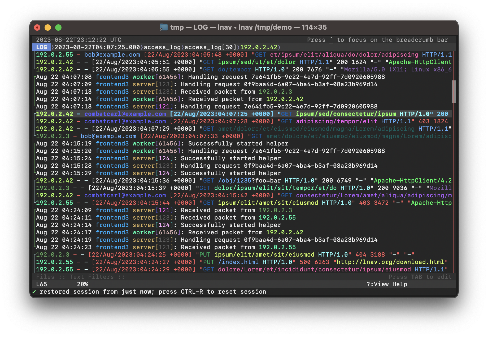

Introduction
============

The Log File Navigator, **lnav**, is an advanced log file viewer for the
terminal.  It provides an :ref:`easy-to-use interface<ui>` for monitoring and
analyzing your log files with little to no setup.  Simply point **lnav** at
your log files and it will automatically detect the :ref:`log_formats`, index
their contents, and display a combined view of all log messages.  You can
navigate through your logs using a variety of :ref:`hotkeys<hotkeys>`.
:ref:`Commands<commands>` give you additional control over **lnav**'s behavior
for doing things like applying filters, tagging messages, and more.  You can
then analyze your log messages using the :ref:`sql-ext`.

   Screenshot of **lnav** viewing syslog and web access_log messages.

Downloads
---------

Binaries and source code for lnav can be downloaded from the
`releases page <https://github.com/tstack/lnav/releases>`_.

When building from source, follow the steps in :ref:`development`.

Viewing Logs
------------

The arguments to **lnav** are the log files, directories, or URLs to be viewed.
For example, to view all of the CUPS logs on your system:

.. prompt:: bash

   lnav /var/log/cups

The formats of the logs are determined automatically and indexed on-the-fly.
See :ref:`log_formats` for a listing of the predefined formats and how to
define your own.

If no arguments are given, **lnav** will try to open the syslog file on your
system:

.. prompt:: bash

   lnav

Setup
-----

After starting **lnav**, you might want to set the
:ref:`configuration options<Configuration>` mentioned below.  Configuration in
**lnav** is done using the :code:`:config` command.  To change a configuration
option, start by pressing :kbd:`:` to enter the command prompt.  Then,
type "config" followed by the option name and value.

.. note::

   Tab-completion is available for these configuration options and, in some
   cases, their values as well.

Keymap
^^^^^^

The keymap defines the mapping from :ref:`hotkeys<hotkeys>` to commands to
execute. The default mapping is for "U.S." keyboards.  The following command
can be used to change the keymap:

.. code-block:: lnav

   :config /ui/keymap <keymap-name>

The builtin keymaps are:

  :de: `German <https://github.com/tstack/lnav/blob/master/src/keymaps/de-keymap.json>`_
  :fr: `French <https://github.com/tstack/lnav/blob/master/src/keymaps/fr-keymap.json>`_
  :sv: `Swedish <https://github.com/tstack/lnav/blob/master/src/keymaps/sv-keymap.json>`_
  :uk: `United Kingdom <https://github.com/tstack/lnav/blob/master/src/keymaps/uk-keymap.json>`_
  :us: `United States <https://github.com/tstack/lnav/blob/master/src/keymaps/us-keymap.json>`_

To create or customize a keymap, consult the :ref:`keymaps` section.

Theme
^^^^^

The visual styling of **lnav** can be customized using a theme.  The following
command can be used to the change the theme:

.. code-block:: lnav

   :config /ui/theme <theme-name>

The builtin themes are:
`default <https://github.com/tstack/lnav/blob/master/src/themes/default-theme.json>`_,
`dracula <https://github.com/tstack/lnav/blob/master/src/themes/dracula.json>`_,
`eldar <https://github.com/tstack/lnav/blob/master/src/themes/eldar.json>`_,
`grayscale <https://github.com/tstack/lnav/blob/master/src/themes/grayscale.json>`_,
`monocai <https://github.com/tstack/lnav/blob/master/src/themes/monocai.json>`_,
`night-owl <https://github.com/tstack/lnav/blob/master/src/themes/night-owl.json>`_,
`solarized-dark <https://github.com/tstack/lnav/blob/master/src/themes/solarized-dark.json>`_,
and
`solarized-light <https://github.com/tstack/lnav/blob/master/src/themes/default-theme.json>`_.

To create or customize a theme, consult the :ref:`themes` section.

Cursor Mode (v0.11.2+)
^^^^^^^^^^^^^^^^^^^^^^

The default mode for scrolling in **lnav** is "cursor" mode where
there is a cursor line in the view that is moved by the arrow keys
and other interactions.  Any interactions, such as jumping to a
search hit, are then focused on that line.

Alternatively, you can enable "top" mode where the contents of the
main view are moved when the arrow keys are pressed.  Any
interactions, such as jumping to a search hit, are then focused
on the top line in the view.  You can change to "top" mode with
the following command:

.. code-block:: lnav

   :config /ui/movement/mode top

Mouse Support (v0.12.2+)
^^^^^^^^^^^^^^^^^^^^^^^^

Mouse support can be enabled temporarily by pressing :kbd:`F2`
and can be set as the default by executing the following command:

.. code-block:: lnav

   :config /ui/mouse/mode enabled

See :ref:`ui_mouse` for more details.

Log Formats
^^^^^^^^^^^

In order for **lnav** to understand your log files, it needs to told how to
parse the log messages using a log format definition.  There are many log
formats builtin and **lnav** will automatically determine the best format to
use.  In case your log file is not recognized, consult the :ref:`log_formats`
section for information on how to create a format.

.. _development:

Development
-----------

Development of lnav is hosted on `GitHub <https://github.com/tstack/lnav/>`_.

`Issues <https://github.com/tstack/lnav/issues>`_ should be used for bugs
and feature requests.

`Discussions <https://github.com/tstack/lnav/discussions>`_ should be used
for asking questions and sharing tips.

Dependencies
^^^^^^^^^^^^

When compiling from source, the following dependencies are required:

* `NCurses <http://www.gnu.org/s/ncurses/>`_
* `PCRE2 <http://www.pcre.org>`_
* `SQLite <http://www.sqlite.org>`_
* `ZLib <http://wwww.zlib.net>`_
* `Bzip2 <http://www.bzip.org>`_
* `Readline <http://www.gnu.org/s/readline>`_
* `libcurl <https://curl.haxx.se>`_
* `libarchive <https://libarchive.org>`_
* `libunistring <https://www.gnu.org/software/libunistring/>`_
* `cargo/rust <https://www.rust-lang.org>`_

Installation
^^^^^^^^^^^^

Check the `downloads page <http://lnav.org/downloads>`_ to see if there are
packages for your operating system.  To compile from source, use the following
commands:

.. note::

   Run :code:`./autogen.sh` if compiling from the git repository.

.. prompt:: bash

   ./configure
   make
   sudo make install

