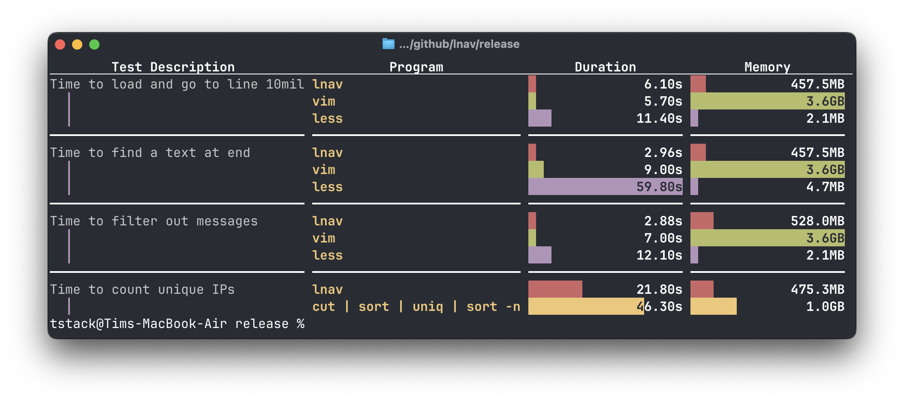

.. _Performance:

Performance
===========

This section provides some performance measurements of **lnav** and
standard utilities.  The numbers in here are for a fairly large
file to demonstrate that lnav is at least competitive with existing
tools if not better.  Since lnav is purpose-built for working with
logs, it is able to perform better and provide a friendlier experience
than traditional tooling.

The measurements are done using this
`E-commerce access log <https://www.kaggle.com/datasets/eliasdabbas/web-server-access-logs>`_
file available on `Kaggle <https://www.kaggle.com>`_.  The file is
3.3GB in size with over 10 million lines.  Tests are run on an
M2 MacBook Air with 24GB of RAM and macOS 15.2.  Memory usage was
measured with Activity Monitor.  If you have any concerns about
the results in here, please open an
`issue <https://github.com/tstack/lnav/issues>`_.

The following chart displays the performance results.
The results are stored in this
`SQLite DB <https://github.com/tstack/lnav/blob/master/release/perf.db>`_.
The DB is updated using the
`update-perf-db.lnav <https://github.com/tstack/lnav/blob/master/release/update-perf-db.lnav>`_
script.
The report is generated using the
`report-perf.lnav <https://github.com/tstack/lnav/blob/master/release/report-perf.lnav>`_
script.

    Performance results as displayed in lnav's DB view.

The rest of this section goes into more detail about the tests themselves.

Indexing
--------

The indexing benchmark tests how long it takes to open the test
file and go to line 10 million.

* :code:`lnav` displays the UI immediately and shows progress
  while loading the file.  The medium-sized memory footprint
  is due to :code:`lnav` creating an index entry for each
  line in the file.  The index allows for immediate jumps to
  different parts of the log by time, log level, and
  line number.
* :code:`vim` loads the entire file without providing any
  feedback during the process.  The large memory footprint is
  due to :code:`vim` loading the entire file into memory.
* :code:`less` displays the start of the file immediately, but
  gives no feedback when scanning to the end of the file.
  The small memory footprint means there is no index and
  :code:`less` needs to scan the file for many operations.

Searching
---------

The search benchmark tests how long it takes to search for the
text "26/Jan/2019:08:59:13", which is at the end of the file.
The search is started after the file has been loaded by the
program.

* :code:`lnav` runs the search in the background and moves a
  bar back-and-forth to show activity.
* :code:`vim` blocks the UI while it scans for the string.
* :code:`less` blocks the UI while it scans for the string.

Filtering
---------

The filtering benchmark tests how long it takes to filter
out the word "Panasonic" and then go to the end of the file.

* :code:`lnav` blocks the UI and moves a bar back-and-forth
  to show activity while evaluating the filter and updating
  the index.
* :code:`vim` blocks the UI while evaluating the filter
  and then pops up a sub-window displaying the results.
* :code:`less` applies the filter immediately and then
  blocks while computing line numbers to go to the end of
  the file.

Statistics
----------

The statistics benchmark tests how long it takes to
count the number of unique IP addresses.  Since :code:`vim` and
:code:`less` cannot do statistics, a pipeline is built with
:code:`cut`, :code:`sort`, and :code:`uniq`.  Working with
the client IP was chosen since it was first column in the
log message.  Performing analyses on other parts of the log
message would require more work to extract the relevant data
with standard tooling.

* :code:`lnav` runs the query in the foreground and progress
  is shown in the bottom right.  When finished, lnav switches
  to the DB view where the results are shown with a bar chart
  in the "total" column to help visualize the values.
  The PRQL query :code:`from access_log | stats.count_by { c_ip }`
  was used to count the unique IPs.
* :code:`shell pipeline` refers to the following pipeline:
  :code:`cut -d ' ' -f 1 shop-access.log | sort | uniq | sort -n`.
  Executing that pipeline executes the whole time without giving
  feedback and dumps to the terminal.  The memory usage listed
  in the chart is from :code:`sort`.  I'm not sure why it is so
  big...
