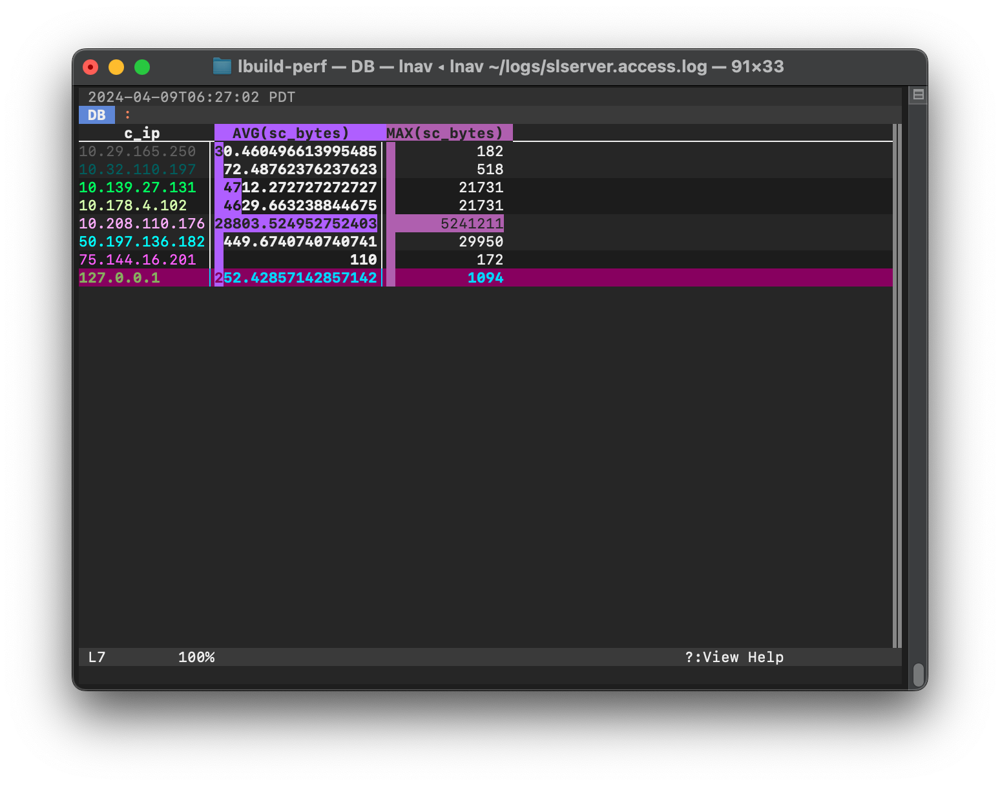

.. _sql-ext:

SQLite Interface
================

Log analysis in **lnav** can be done using the SQLite interface.  Log messages
can be accessed via `virtual tables <https://www.sqlite.org/vtab.html>`_ that
are created for each file format.  The tables have the same name as the log
format and each message is its own row in the table.  For example, given the
following log message from an Apache access log::

    127.0.0.1 - frank [10/Oct/2000:13:55:36 -0700] "GET /apache_pb.gif HTTP/1.0" 200 2326

These columns would be available for its row in the :code:`access_log` table:

.. csv-table::
    :class: query-results
    :header-rows: 1

    log_line,log_part,log_time,log_idle_msecs,log_level,log_mark,log_comment,log_tags,log_filters,c_ip,cs_method,cs_referer,cs_uri_query,cs_uri_stem,cs_user_agent,cs_username,cs_version,sc_bytes,sc_status
    0,<NULL>,2000-10-10 13:55:36.000,0,info,1,<NULL>,<NULL>,<NULL>,127.0.0.1,GET,<NULL>,<NULL>,/apache_pb.gif,<NULL>,frank,HTTP/1.0,2326,200

.. note:: Some columns are hidden by default to reduce the amount of noise in
   results, but they can still be accessed when explicitly used.  The hidden
   columns are: :code:`log_path`, :code:`log_text`, :code:`log_body`, and
   :code:`log_raw_text`.

You can activate the SQL prompt by pressing the :kbd:`;` key.  At the
prompt, you can start typing in the desired SQL statement and/or double-tap
:kbd:`TAB` to activate auto-completion.  A help window will appear above
the prompt to guide you in the usage of SQL keywords and functions.

.. figure:: sql-help.png
   :align: center

   Screenshot of the online help for the SQL prompt.

.. figure:: group_concat-help.png
   :align: center

   Screenshot of the online help for the :code:`group_concat()` function.

A simple query to perform on an Apache access log might be to get the average
and maximum number of bytes returned by the server, grouped by IP address:

.. code-block:: custsqlite

    ;SELECT c_ip, avg(sc_bytes), max(sc_bytes) FROM access_log GROUP BY c_ip

After pressing :kbd:`Enter`, SQLite will execute the query using **lnav**'s
virtual table implementation to extract the data directly from the log files.
Once the query has finished, the main window will switch to the DB view to
show the results.  Press :kbd:`q` to return to the log view and press :kbd:`v`
to return to the log view.  If the SQL results contain a
:code:`log_line` column, you can press to :kbd:`Shift` + :kbd:`V` to
switch between the DB view and the log

   Screenshot of the SQL results view.

The DB view has the following display features:

* Column headers stick to the top of the view when scrolling.
* A stacked bar chart of the numeric column values is displayed underneath the
  rows.  Pressing :kbd:`TAB` will cycle through displaying no columns, each
  individual column, or all columns.
* JSON columns in the top row can be pretty-printed by pressing :kbd:`p`.
  The display will show the value and JSON-Pointer path that can be passed to
  the `jget`_ function.

PRQL Support (v0.12.1+)
-----------------------

`PRQL <https://prql-lang.org>`_ is an alternative database query language
that compiles to SQLite.  You can enter PRQL in the database query prompt
and lnav will switch accordingly.  A major advantage of using PRQL is that
lnav can show previews of the results of the pipeline stages and provide
better tab completion options.

A PRQL query starts with the :code:`from` keyword that specifies the table
to use as a data source.  The next stage of a pipeline is started by
entering a pipe symbol (:code:`|`) followed by a
`PRQL transform <https://prql-lang.org/book/reference/stdlib/transforms/index.html>`_.
As you build the query in the prompt, lnav will display any relevant
help and preview for the current and previous stages of the pipeline.

The following is a screenshot of lnav viewing a web access log with a
query in progress:

   Screenshot of a PRQL query in progress

The top half of the window is the usual log message view.  Below that is
the online help panel showing the documentation for the :code:`stats.count_by`
PRQL function.  lnav will show the help for what is currently under the
cursor.  The next panel shows the preview data for the pipeline stage
that precedes the stage where the cursor is.  In this case, the
results of :code:`from access_log`, which is the contents of the access
log table.  The second preview window shows the result of the
pipeline stage where the cursor is located.

Log Tables
----------

Each log format has its own database table that can be used to access log
messages that match that format.  The table name is the same as the format
name, for example, the :code:`syslog_log` format will have a table that is
also named :code:`syslog_log`.  There is also an :code:`all_logs` table
that provides access to all messages from all formats.

.. note:: Only the displayed log messages are reflected in the SQLite
   interface.  Any log messages that have been filtered out are not
   accessible.

The columns in the log tables are made up of several builtins along with
the values captured by the log format specification.  Use the :code:`.schema`
command in the SQL prompt to examine a dump of the current database schema.

The following columns are builtin and included in a :code:`SELECT *`:

  :log_line: The line number for the message in the log view.
  :log_part: The partition the message is in.  This column can be changed by
    an :code:`UPDATE` or the :ref:`:parition-name<partition_name>` command.
  :log_time: The adjusted timestamp for the log message.  This time can differ
    from the log message's time stamp if it arrived out-of-order and the log
    format expects log files to be time-ordered.
  :log_actual_time: The log messages original timestamp in the file.
  :log_idle_msecs: The difference in time between this messages and the
    previous.  The unit of time is milliseconds.
  :log_level: The log message level.
  :log_mark: True if the log message was marked by the user.
  :log_comment: The comment for the message.  This column can be changed by
    an :code:`UPDATE` or the :ref:`:comment<comment>` command.
  :log_tags: A JSON list of tags for the message.  This column can be changed
    by an :code:`UPDATE` or the :ref:`:tag<tag>` command.
  :log_annotations: A JSON object of annotations for this message.
    This column is populated by the :ref:`:annotate<annotate>` command.
  :log_filters: A JSON list of filter IDs that matched this message

The following columns are builtin and are hidden, so they will *not* be
included in a :code:`SELECT *`:

  :log_time_msecs: The adjusted timestamp for the log message as the number of
    milliseconds from the epoch.  This column can be more efficient to use for
    time-related operations, like :ref:`timeslice()<timeslice>`.
  :log_path: The path to the log file this message is from.
  :log_text: The full text of the log message.
  :log_body: The body of the log message.
  :log_raw_text: The raw text of this message from the log file.  In this case
    of JSON and CSV logs, this will be the exact line of JSON-Line and CSV
    text from the file.

Extensions
----------

To make it easier to analyze log data from within **lnav**, there are several
built-in extensions that provide extra functions and collators beyond those
`provided by SQLite <http://www.sqlite.org/lang_corefunc.html>`_.  The majority
of the functions are from the
`extensions-functions.c <http://www.sqlite.org/contrib>`_ file available from
the `sqlite.org <http://sqlite.org>`_ web site.

.. tip:: You can include a SQLite database file on the command-line and use
  **lnav**'s interface to perform queries.  The database will be attached with
  a name based on the database file name.

Commands
--------

A SQL command is an internal macro implemented by lnav.

* :code:`.schema` - Open the schema view.  This view contains a dump of the
  schema for the internal tables and any tables in attached databases.
* :code:`.msgformats` - Executes a canned query that groups and counts log
  messages by the format of their message bodies.  This command can be useful
  for quickly finding out the types of messages that are most common in a log
  file.

Variables
---------

The following variables are available in SQL statements:

* :code:`$LINES` - The number of lines in the terminal window.
* :code:`$COLS` - The number of columns in the terminal window.

Environment
-----------

Environment variables can be accessed in queries using the usual syntax of
:code:`$VAR_NAME`.  For example, to read the value of the "USER" variable, you
can write:

.. code-block:: custsqlite

    ;SELECT $USER

.. _collators:

Collators
---------

* **naturalcase** - Compare strings "naturally" so that number values in the
  string are compared based on their numeric value and not their character
  values.  For example, "foo10" would be considered greater than "foo2".
* **naturalnocase** - The same as naturalcase, but case-insensitive.
* **ipaddress** - Compare IPv4/IPv6 addresses.

Reference
---------

The following is a reference of the SQL syntax and functions that are available:

.. include:: ../../src/internals/sql-ref.rst
