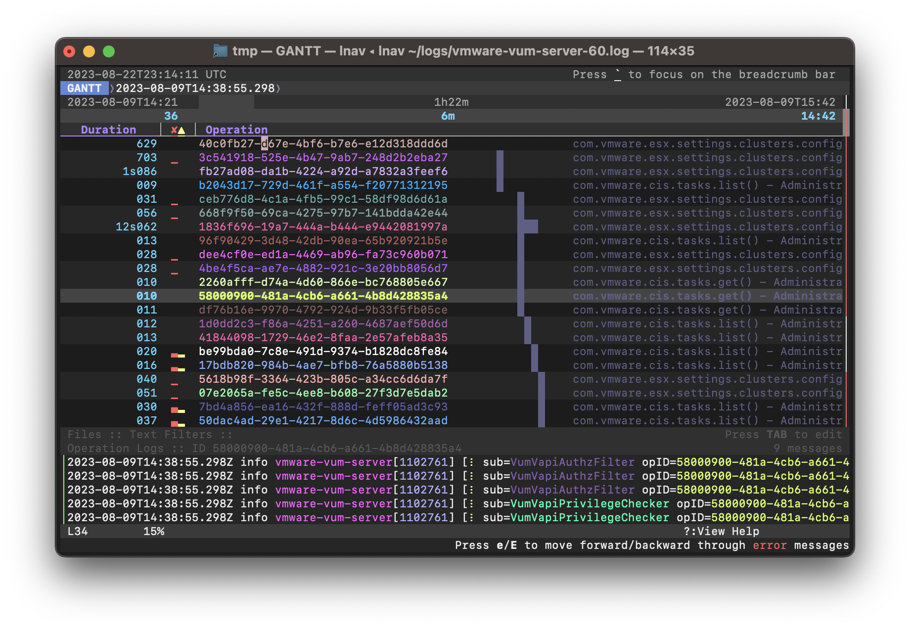

.. _ui:

User Interface
==============

The **lnav** TUI displays the content of the current "view" in the middle,
with status bars above and below, and the interactive prompt as the last line.

.. figure:: lnav-ui.png
   :align: center
   :figwidth: 90%

   Screenshot of **lnav** viewing syslog and web access_log messages.

The default view shows the log messages from the log files that have been
loaded.  There are other views for displaying content like plaintext files
and SQL results.  The :ref:`ui_views` section describes the characteristics of
each view in more detail.  You can switch to the different views using the
hotkeys described in the :ref:`hotkeys_display` section or by pressing
:kbd:`ENTER` to activate the breadcrumb bar, moving to the first crumb, and
then selecting the desired view.  You can switch back to the previous view by
pressing :kbd:`q`.  You can switch forward to the new view by pressing
:kbd:`a`.  If the views are time-based (e.g. log and histogram), pressing
:kbd:`Shift` + :kbd:`q` and :kbd:`Shift` + :kbd:`a` will synchronize the top
times in the views.

**lnav** provides many operations to work with the log/text data in the
main view.  For example, you can add comments and tags to log messages.
The highlighted cursor line is used as the reference point to edit the
comment or tags.  Alternatively, you can press :kbd:`Ctrl` + :kbd:`x`
to switch to "top" mode where the "focused" line is the top line in the
view and most operations now work with that line.  When in "cursor" mode,
the :kbd:`↑` and :kbd:`↓` keys now move the focused line instead of scrolling
the view.  Jumping to bookmarks, like errors, will also move the focused
line instead of moving the next error to the top of the view.

The right side of the display has a proportionally sized 'scrollbar' that
shows:

* the current position in the file;
* the locations of errors/warnings in the log files by using red or yellow
  coloring;
* the locations of search hits by using a tick-mark pointing to the left;
* the locations of bookmarks by using a tick-mark pointing to the right.

Top Status Bar
--------------

The top status bar shows the current time and messages stored in the
:ref:`table_lnav_user_notifications` table.

Below the top status bar is the breadcrumb bar that displays the semantic
location of the focused line in the main view.  For example, within a
pretty-printed JSON document, it will show the path to property at the top
of the view.  The actual content of the bar depends on the current view and
will be updated as you navigate around the main view.  The bar can also be
used to navigate around the document by focusing on it.

Breadcrumb Bar
--------------

.. figure:: lnav-breadcrumbs-help.png
   :align: center
   :figwidth: 90%

   Screenshot of the breadcrumb bar focused and navigating the help text

To focus on the breadcrumb bar, press :kbd:`ENTER`.  The :kbd:`←`/:kbd:`→`
cursor keys can be used to select a crumb and the :kbd:`↑`/:kbd:`↓` keys can
be used select a value of that crumb.  To accept a value and drop focus on the
bar, press :kbd:`ENTER`.  To accept a value and move to the next crumb, press
:kbd:`→`.  Using :kbd:`→` makes it quicker to drill down into a document
without having to constantly switch focus.  To drop focus on the bar without
accepting anything, press :kbd:`Escape`.

There are three types of crumbs:

* a dropdown where one of a limited set of values can be selected;
* a combobox where a value can be entered directly or selected;
* a numeric input for entering array indexes.

When a dropdown or combobox is selected, you can type part of the desired value
to filter the list of values.  For example, the first crumb is always the
current view, typing in "hi" will filter the list down to the "HIST" value.

Configuration Panels
--------------------

.. figure:: lnav-config-header.png
   :align: center
   :figwidth: 90%

   Screenshot of the header for the configuration panels when they are hidden.

After the main view content, there is a header bar for two configuration
panels: Files and Filters.  These panels provide visual access to parts of
lnav's configuration.  To access the panels, press the :kbd:`TAB` key.
To hide the panels again, press :kbd:`q`.

.. figure:: lnav-files-panel.png
   :align: center
   :figwidth: 90%

   Screenshot of the files panel showing the loaded files.

The Files panel is open initially to display progress in loading files.
The following information is displayed for each file:

* the "unique" portion of the path relative to the other files and
* the amount of data that has been indexed.

To the right of the file list is a panel that shows details for each
file, such as:

* the date range of log messages contained in the file;
* the errors that were encountered while trying to index the file;
* the notes recorded for files where some automatic action was taken,
  like hiding the file if it was seen as a duplicate of another file;
* the details of the demultiplexing and log format matching process.

.. figure:: lnav-filters-panel.png
   :align: center
   :figwidth: 90%

   Screenshot of the filters panel showing an OUT and a disabled IN filter.

If the view supports filtering, there will be a status line showing the
following:

* the number of enabled filters and the total number of filters;
* the number of lines that are **not** displayed because of filtering.

To edit the filters, you can press TAB to change the focus from the main
view to the filter editor.  The editor allows you to create, enable/disable,
and delete filters easily.

Bottom Status Bar
-----------------

The second to last line is the bottom status bar, which shows the following:

* the line number of the focused line, starting from zero;
* the location within the view, as a percentage;
* the current search hit, the total number of hits, and the search term;
* the loading indicator.

When the interactive prompt is active, this bar can show the prompt
description, help text, or error message.

Prompt
------

Finally, the last line on the display is where you can enter search
patterns and execute internal commands, such as converting a
unix-timestamp into a human-readable date.  The following key-presses
will activate a corresponding prompt:

* :kbd:`/` - The search prompt.  You can enter a PCRE2-flavored regular
  expression to search for in the current view.
* :kbd:`:` - The command prompt.  Commands are used to perform common
  operations.
* :kbd:`;` - The SQL prompt.  SQL queries can be used for log analysis
  and manipulating **lnav**'s state.
* :kbd:`|` - The script prompt.  Enter a path to the lnav script to
  execute, along with the arguments to pass in.

The command-line is by the readline library, so the usual set of keyboard
shortcuts can be used for editing and moving within the command-line.

.. _ui_views:

Views
-----

The accessible content within lnav is separated into the following views.

LOG
^^^

The log view displays the log messages from any loaded log files in time
order.  This view will be shown by default if any log files were detected.
If plain text files were also loaded, they will be available in the TEXT
view, which you can switch to by pressing :kbd:`t`.

On color displays, the log messages will be highlighted as follows:

* Errors will be colored in red;
* warnings will be yellow;
* search hits are reverse video;
* various color highlights will be applied to: IP addresses, SQL keywords,
  XML tags, file and line numbers in Java backtraces, and quoted strings;
* "identifiers" in the messages will be randomly assigned colors based on their
  content (works best on "xterm-256color" terminals).

.. note::

  If the coloring is too much for your tastes, you can change to the
  "grayscale" theme by entering the following command:

  .. code-block::  lnav

    :config /ui/theme grayscale

Timestamps in log messages will be rewritten to the local timezone (or the
timezone specified by :envvar:`TZ`) automatically if they include a
timezone component.  If a file's timestamps do not include a timezone, they
will be treated as if they are from the local zone.  You can change the zone
to use for these types of files using the
:ref:`:set-file-timezone<set_file_timezone>` command.

.. note::

  If a log message has a timestamp that is out-of-order with its neighboring
  messages, the timestamp will be highlighted in yellow.  When one of these
  messages is focused, an overlay will display the
  difference between the "actual time" and the "received time".  The "actual
  time" is the original textual timestamp.  The "received time" is the time
  of an earlier message that is larger than this log message's time.

To get more details about a log message, move to the starting line of the
message and press :kbd:`p` to open an overlay with information about the
timestamp and individual fields.  You then can focus into the overlay panel
by pressing :kbd:`Ctrl` + :kbd:`]` to operate on individual fields in the
message.  Inside the overlay, the following hotkeys are supported:

* :kbd:`SPC` to toggle field visibility
* :kbd:`c` to copy the value of a field
* :kbd:`#` to open the SQL prompt with a query to create a chart of this
  field's values over time.

The source file name for each message can be displayed by scrolling left.
Scrolling left once will show the shortened version of the file name relative
to the other files that are loaded.  In the shortened version, the unique
portion of the file name will be in square brackets.  Scrolling left a second
time will show the full path.

The breadcrumb bar will show the following crumbs:

* the timestamp for the focused line;
* the log format for the focused line;
* the name of the file the focused line was pulled from;
* the "operation ID" of the focused log message, if it is supported by the log
  format.

These crumbs are interactive and can be used to navigate to different parts
of the log view.  For example, selecting a different value in the log format
crumb will jump to the first message with that format.

The file crumb will show a "↻" icon if the file is from the output of a FIFO,
:code:`:sh` command, or data that was piped into the standard input.  When
the pipe is closed, the icon will disappear.

TEXT
^^^^

The text view displays files for which lnav could not detect any log messages.

Press :kbd:`t` to switch to the text view.  While in the text view, you can
press :kbd:`f` or :kbd:`Shift` + :kbd:`F` to switch to the next / previous
text file.

The breadcrumb bar will show the name of the file and any structure that was
discovered in the content.  The file crumb will show a "↻" icon if the file
is from the output of a FIFO, :code:`:sh` command, or data that was piped
into the standard input.  When the pipe is closed, the icon will disappear.

If the content is piped into lnav through standard input, a FIFO, or a
:code:`:sh` command, the time that lines are received are recorded.  You
can press :kbd:`Shift` + :kbd:`T` to view the elapsed time like in the
LOG view.  The breadcrumb bar will also show the received time of the
focused line after the file name crumb.  If the output being shown is from
a :code:`:sh` command, you can press :kbd:`Ctrl` + :kbd:`C` to send a
SIGINT to the child process without killing **lnav** itself.

   Screenshot of the TEXT view showing the output of :code:`sh make check`.
   Each line is timestamped internally when it was received so it's
   possible to view how long each test is taking to run.  The "↻" icon
   next to the file name in the breadcrumb bar means that the make is
   still running.

Markdown
""""""""

Files with an :code:`.md` (or :code:`.markdown`) extension will be treated as
Markdown files and rendered separately.

   Viewing the **lnav** :file:`README.md` file.

DB
^^

The DB view shows the results of queries done through the SQLite interface.
You can execute a query by pressing :kbd:`;` and then entering a SQL statement.

Press :kbd:`v` to switch to the database result view.

HELP
^^^^

The help view displays the builtin help text.  While in the help view, the
breadcrumb bar can be used to navigate to different sections of the document.

Press :kbd:`?` to switch to the help view.

HIST
^^^^

The histogram view displays a stacked bar chart of messages over time
classified by their log level and whether they've been bookmarked.

Press :kbd:`i` to switch back and forth to the histogram view.  You
can also press :kbd:`Shift` + :kbd:`i` to toggle the histogram view
while synchronizing the top time.  While in the histogram view,
pressing :kbd:`z` / :kbd:`Shift` + :kbd:`z` will zoom in/out.

.. _timeline:

TIMELINE
^^^^^^^^

.. note:: This feature is available in v0.12.0+.

   Screenshot of the timeline view when viewing logs from the
   VMWare Update Manager.  Most rows show API requests as they
   are received and processed.

The timeline view [#]_ visualizes operations over time.  The operations
are identified by the "opid" field defined in the log format.  If the
format does not define an OP ID, you can set one manually by doing an
:code:`UPDATE` of the :code:`log_opid` column on the log vtable.

In the view, there is a header that shows the overall time span, the
narrowed time span around the focused line, and the column headers.
Each row in the view shows the following:

* The duration of the operation
* Sparklines showing the number of errors and warnings relative to the
  total number of messages associated with the OPID.
* The OPID itself.
* A description of the operation as captured from the log messages.

The rows are sorted by the start time of each operation.

If an operation row is in the focused time span, a reverse-video
bar will show when the operation started and finished (unless it
extends outside the time span).  As you move the focused line, the
focused time span will be adjusted to keep the preceding and following
five operations within the span.

The preview panel at the bottom of the display will show the
messages associated with the focused operation.

The following hotkeys can be useful in this view:

* :kbd:`p` -- If the log format defined sub-operations with the
  :code:`opid/subid` property, this will toggle an overlay panel
  that displays the sub-operation descriptions.

  .. figure:: lnav-timeline-2.png
     :align: center

     Screenshot showing the same log as above after pressing
     :kbd:`p`.  The overlay panel shows a breakdown of
     sub-operations performed while processing the main operation.

* :kbd:`Shift` + :kbd:`q` -- Return to the previous view and change
  its focused line to match the time that was focused in the timeline
  view.
* :kbd:`Shift` + :kbd:`a` -- After leaving the timeline view, pressing
  these keys will return to the timeline view while keeping the focused
  time in sync.

.. [#] Formerly called the "Gantt Chart" view.

PRETTY
^^^^^^

The pretty-print view takes the text displayed in the current view and shows
the result of a pretty-printer run on that text.  For example, if a log
message contained an XML message on a single line, the pretty-printer would
break the XML across multiple lines with appropriate indentation.

   Screenshot of a log message with a flat JSON object.

   Screenshot of the same log message in the PRETTY view.  The JSON object
   is now indented for easier reading.

Press :kbd:`Shift` + :kbd:`P` to switch to the pretty-print view.

SCHEMA
^^^^^^

The schema view displays the current schema of the builtin SQLite database.

Press :kbd:`;` to enter the SQL prompt and then enter :code:`.schema` to
open the schema view.

SPECTRO
^^^^^^^

The spectrogram view is a "three"-dimensional display of data points of a log
field or a SQL query column.  The dimensions are time on the Y axis, the range
of data point values on the X axis, and the number of data points as a color.
For example, if you were to visualize process CPU usage over time, the range
of values on the X axis would be CPU percentages and there would be colored
blocks at each point on the line where a process had that CPU percentage, like
so

.. figure:: lnav-spectro-cpu-pct.png
   :align: center

   Screenshot of the **lnav** spectrogram view showing CPU usage of processes.

The colors correspond to the relative number of data points in a bucket.
The legend overlaid at the top line in the view shows the counts of data
points that are in a particular color, with green having the fewest number of
data points, yellow the middle, and red the most.  You can select a particular
bucket using the cursor keys to see the exact number of data points and the
range of values.  The panel at the bottom of the view shows the data points
themselves from the original source, the log file or the SQL query results.
You can press :kbd:`TAB` to focus on the details panel so you can scroll
around and get a closer look at the values.

.. _ui_mouse:

Mouse Support (v0.12.2+)
------------------------

With mouse support enabled, either through the `/ui/mouse/mode`
configuration option or by pressing :kbd:`F2`, many of the UI
elements will respond to mouse inputs:

* clicking on the main view will move the cursor to the given
  row and dragging will scroll the view as needed;
* :kbd:`Shift` (or :kbd:`CTRL`) clicking/dragging in the main
  view will highlight lines and then toggle their bookmark
  status on release;
* double-clicking in the main view will select the underlying
  text and drag-selecting within a line will select the given
  text;
* when double-clicking text: if the mouse pointer is inside
  a quoted string, the contents of the string will be selected;
  if the mouse pointer is on the quote, the quote will be included
  in the selection; if the mouse pointer is over a bracket
  (e.g. [],{},()) where the matching bracket is on the same line,
  the selection will span from one bracket to the other;
* when text is selected, a menu will pop up that can be used
  to filter based on the current text, search for it, or copy
  it to the clipboard;
* right-clicking the start of a message in the LOG view or a
  row in the DB view will open the details overlay;
* the details overlay displays a diamond next to fields to
  indicate whether they are shown/hidden and this can be
  clicked to toggle the state;
* the log details will show a bar chart icon for fields with
  values which, when clicked, will open either the spectrogram
  view for the given field or open the DB query prompt with a
  PRQL query to generate a histogram of the field values;
* left-clicking a local link in a Markdown document will move
  the cursor to that part of the document;
* right-clicking a link in a Markdown document will open an
  overlay menu with relevant options;
* clicking in the scroll area will move the view by a page,
  double-clicking will move the view to that area, and
  dragging the scrollbar will move the view to the given spot;
* clicking on the breadcrumb bar will select a crumb and
  selecting a possibility from the popup will move to that
  location in the view;
* clicking on portions of the bottom status bar will trigger
  a relevant action (e.g. clicking the line number will open
  the command prompt with :code:`:goto <current-line>`);
* clicking on the configuration panel tabs (i.e. Files/Filters)
  will open the selected panel and clicking parts of the
  display in there will perform the relevant action (e.g.
  clicking the diamond will enable/disable the file/filter);
* clicking in a prompt will move the cursor to the location;
* clicking on a column in the spectrogram view will select it.

.. note::

   A downside of enabling mouse support is that normal text
   selection and copy will no longer work.  While lnav has
   some support for selection in the main view, there are
   still likely to be cases where that is insufficient.
   In those cases, you can press :kbd:`F2` to quickly
   switch back-and-forth.  Or, some terminals have support
   for switching while a modifier is pressed:

   .. list-table::
      :header-rows: 1

      * - Key
        - Terminal
      * - :kbd:`Option`
        - iTerm, Hyper
      * - :kbd:`Fn`
        - Terminal.app
