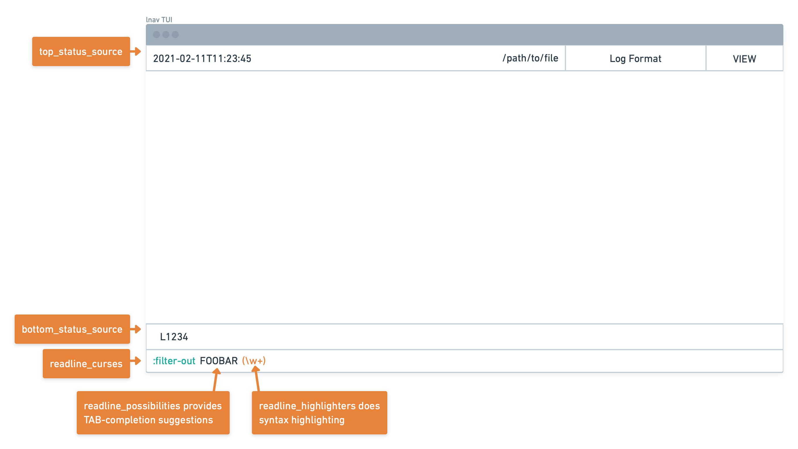
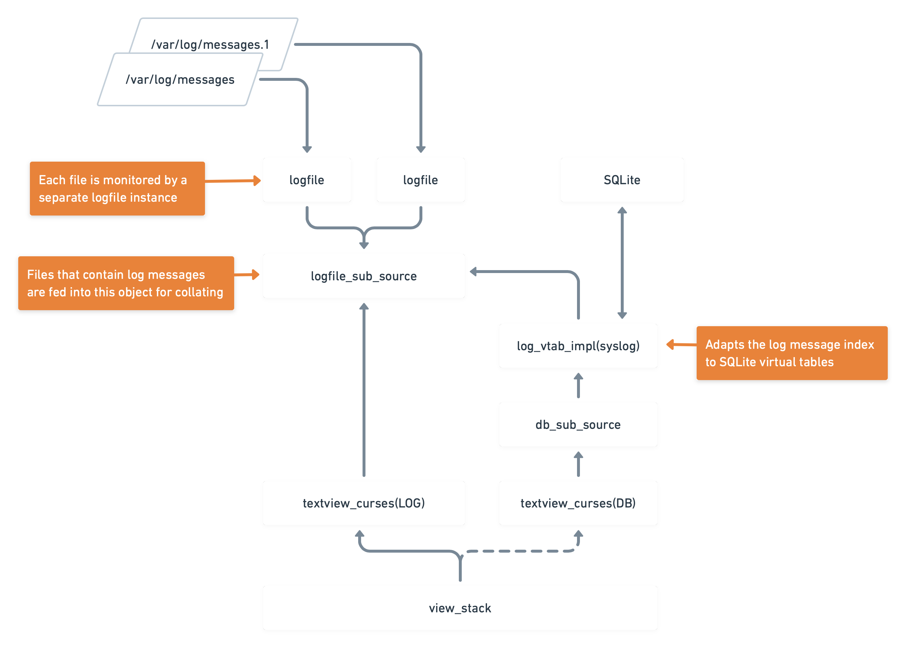

{
"comment": "This is JSON front-matter"
}

# Table of Contents

- [Table of Contents](#table-of-contents)
    - [Test](#test)
    - [Github Alerts](#github-alerts)
    - [Table](#table)

## Test

* One
* Two
* Three





<span style="color: #f00; font-weight: bold">Bold red</span>

~~Strikethrough~~

*italic*

**bold**

_underline_

<span style="text-decoration: underline; background-color: darkblue">
Underline</span>

<pre>
  Hello,
  <span class="name">World</span>!
</pre>

Goodbye, <span style="border-left: solid cyan; border-right: dashed green">
World</span>!

```foolang
foo bar bar
baz "xyz"
```

```c
/*
 * This program prints "Hello, World!"
 */

#include <stdio.h>

int main() {
    printf("Hello, World!\n");
}
```

```python
def hw(name):
    """
    This function prints "Hello, <name>!"
    """

    print(f"Hello, {name}!")  # test comment
```

```xml
<?xml version="1.0" encoding="utf-8" ?>
<books>
    <!-- Line comment -->
    <book id="100">
        <author>Finnegan</author>
    </book>
</books>
```

## Github Alerts

> [!NOTE]
> Useful information that users should know, even when skimming content.

> [!TIP]
> Helpful advice for doing things better or more easily.

> [!IMPORTANT]
> Key information users need to know to achieve their goal.

> [!WARNING]
> Urgent info that needs immediate user attention to avoid problems.

> [!CAUTION]
> Advises about risks or negative outcomes of certain actions.

## Tasks

* [x] Bibimbap
* [x] Waffles
* [ ] Tacos

## Table

|  ID |    Name     | Description   |
|----:|:-----------:|---------------|
|   1 |     One     | The first     |
|   2 |     Two     | The second    |
|   3 |    Three    | The third     |
|   4 |    Four     | The fourth    |
|  .. |     ..      | ..            |
| 100 | One Hundred | The hundredth |

| abc        | def |
|------------|-----|
| foo \| bar | ddd |

<table>
<tr>
<th>
Foo
</th>
<td>
Bar
</td>
</tr>
<tr>
<th>
Foo
</th>
<td>
Bar
</td>
</tr>
</table>
